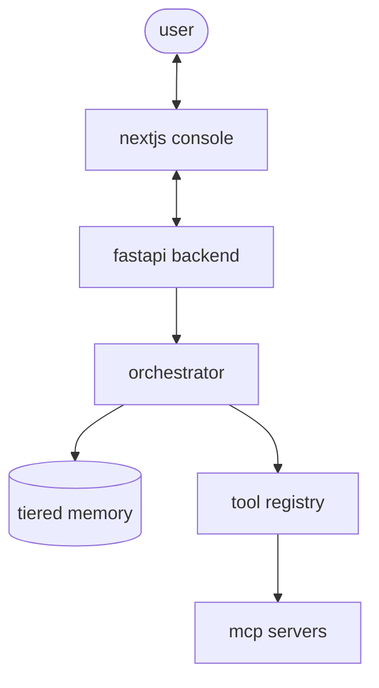

# agentos: precision agent orchestration

agentos is a high-performance framework for building agents that actually work. it focuses on observability, tiered memory, and modular tooling so you can see exactly what your agent is thinking, doing, and retrieving.

---

## what’s inside

- **3-tier memory**: working (short-term), episodic (verified runs), and semantic (durable facts). includes a knowledge graph for entities and relations.
- **deep traces**: every step is captured (understand -> plan -> tool -> verify). scores are annotated live so you can debug the "why" behind an answer.
- **modular tools**: supports mcp (model context protocol) and a sandboxed workspace for safe local file ops.
- **operator console**: a clean next.js 15 dashboard to chat with your agent and inspect memory.

---

## architecture



---

## get it running

### backend
```bash
python -m venv venv
source venv/bin/activate
pip install -e .
pip install -r backend/requirements.txt
cp .env.example .env # flip the llm settings here
```

### frontend
```bash
cd frontend
npm install
```

### spin up
1. **backend**: `venv/bin/python -m agentos.main`
2. **frontend**: `cd frontend && npm run dev`
-> check it at `http://localhost:3000`

---

## eval & benchmark
run tasks across retrieval, tool-use, and multi-step slices. agents are scored on success rate, tool precision, and reflection roi. use these to test if your memory or planning changes actually improve performance.

---

## main settings (`.env`)

| variable | default | notes |
|---|---|---|
| `AGENTOS_LLM_BACKEND` | `mock` | `mock` or `ollama` |
| `AGENTOS_DB_PATH` | `./data/agentos.db` | sqlite path |
| `AGENTOS_MAX_STEPS` | `4` | loop limit |
| `AGENTOS_ENABLE_MEMORY` | `true` | toggle tiered storage |

---

## license
personal project. use it, break it, build it.
